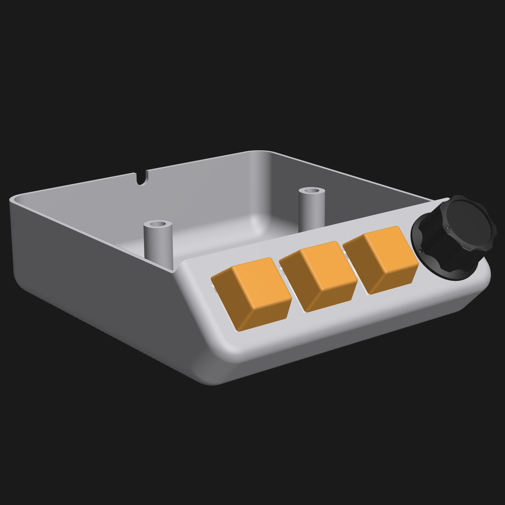

# ESPHome media controller for Home Assistant
[ESPHome](https://esphome.io/) media controller is made by [Floris van de Sande](https://florisvandesande.com/) and is meant to be used with [Home Assistant](https://www.home-assistant.io).

## Features
- Three buttons which you can use in your [Home Assistant](https://www.home-assistant.io) automations
- Rotary knob to Play/Pause your music and adjust the Volume
- Minimal design
- Easy to make and install

_You can use the buttons to do anything in Home Assistant, the aren't programmed in the yaml-code._

## Hardware

| Part list       | Amount    |
| --------------- | --------- |
| D1 Mini ESP8266 | 1         |
| Rotary Encoder  | 1         |
| Key Switches    | 3         |
| Key Caps        | 3         |
| Electrical wire | ± 100 cm  |
| Screws 50 mm    | 3         |
| 5v power supply | optional  |

#### Other hardware
- 3D printer with filament of your choice
- Soldering iron

You can find the STL files for the case and the knob here:
- [Case and knob on Github](stl/ESPHome-Media-controller.stl)
- [Case and knob on Printables](https://www.printables.com/model/551624-esphome-media-controller)
- [Case and knob on Thingiverse](https://www.thingiverse.com/thing:6167722)

## Wiring
| D1 Mini ESP8266 | Rotary Encoder | Switches     | Cable color |
| --------------- | -------------- | ------------ | ----------- |
| D2 / GPIO4      | Switch         |              | White       |
| D3 / GPIO0      | PIN Out A      |              | Black       |
| D4 / GPIO2      | Pin Out B      |              | Black       |
| G  / GND        | GND and GND    | Button 1/2/3 | Yellow      |
| D5 / GPIO14     |                | Button 1     | Blue        |
| D6 / GPIO12     |                | Button 2     | Green       |
| D7 / GPIO13     |                | Button 3     | Red         |

| D1 mini ESP8266                 | Rotary encoder                         |
| ------------------------------- | -------------------------------------- |
|  |  |

## Code
At the top of the [yaml](ESPHome-media-controller.yaml) are the **substitutions** which are used througout the code which you can easily change. The main one to change is the **media_player** substitution, as you won't be able to use the Rotary encoder for Play/Pause otherwise.
Of course your could go down to the **sensor** part of the code to change the behavior of the rotary encoder; for example to use it to dim your lights.

## Assembly
- Print the case and the knob
- Solder the wires to the switches and the rotary encoder
- Insert the switches and rotary knob in the printed case
- Solder the wires from the switches and rotary encoder to the D1 mini
- Flash the D1 mini and test if everything works as expected
- Screw the case to the underside of your desk / table

## Thank you
- [Adamaze](https://github.com/adamaze) for his work on the [ESPHome Volume Knob](https://github.com/adamaze/esphome_volume_knob)
- [Peter Remøy Paulsen](https://github.com/petrepa) for his work on the [Deskcontroller for ESPHome](https://github.com/petrepa/ESPHome-Desk-Controller/tree/main)
- [Lars Ahlzen](https://www.thingiverse.com/sebajom/designs) for his [knob designs](https://www.thingiverse.com/thing:4807288)
